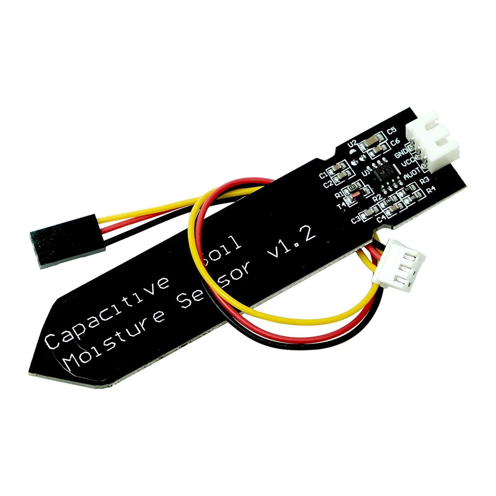
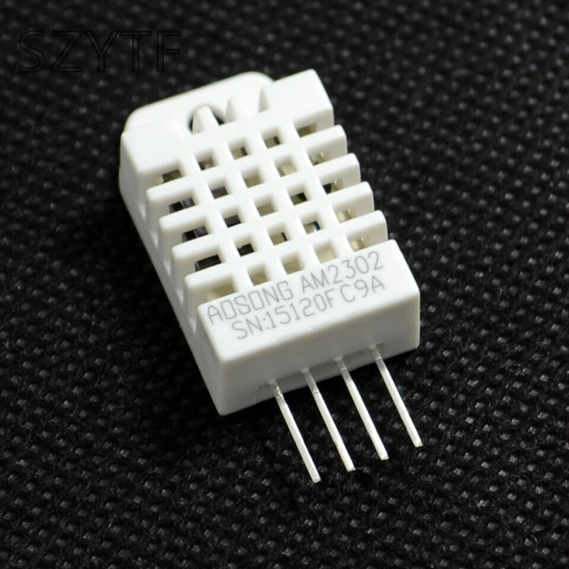

## Required Components for the ESP32 Smart Irrigation System
* ESP32 Board
* Capacitive soil Moisture Sensor
* Water level sensor
* DHT22
* Water Pump
* Relay Module
* 3.7 V Li-ion Battery
* 5V RGB led Strip
* Connecting Wires

### Capacitive Soil Moisture Sensor

This is an analog capacitive soil moisture sensor that measures soil moisture levels through capacitive sensing. It adjusts its capacitance based on the amount of water in the soil. You can translate this capacitance variation into a voltage level, ranging from a minimum of 1.2V to a maximum of 3.0V. One of the benefits of the Capacitive Soil Moisture Sensor is its construction from corrosion-resistant materials, ensuring a prolonged service life.

### DHT22 Humidity Temperature Sensor

The DHT11 is a basic and cheap sensor that measures both temperature and humidity. It uses a special sensor to find out how much humidity is in the air and a temperature sensor to measure the temperature. The sensor gives us this information in a digital way through a single wire. It's easy to use, but we need to be patient because it takes about 2 seconds to get new information. In our project, we'll use this sensor to tell us how hot and humid the air is.

## ESP32 Smart Irrigation System Code Explanation

The arduino code handles IoT, RGB LED Strip animation, and the sensors (DHT22, soil moisture sensor and water level), controlled and monitored through Blynk. The pump and Indication Led rely on soil moisture and water level. Additionally, there are functions for changing color palettes and other visual effects of RGB LED Strip.

**Libraries**

* WiFi library — [Download](URL)
* Blynk library — [Download](URL)
* DHT library — [Download](URL)
* FastLED library — [Download](URL)